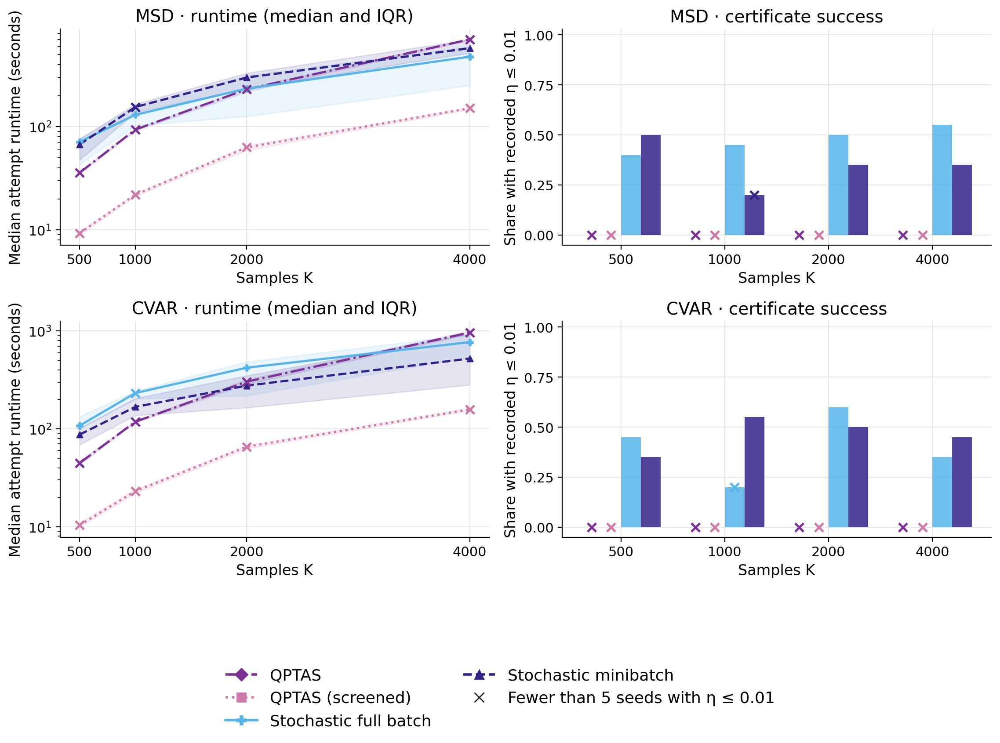

# Coherent Utility Measure Games (`cumg`)

Reference implementation and reproducibility artifacts for
[*Data-Driven Games with Coherent Risk Measures*](https://arxiv.org/abs/2605.19302)
by Bharat Gangwani and Arunesh Sinha.

Coherent Utility Measure Games (CUMGs) model players whose uncertain payoffs
are evaluated with coherent utility (risk) measures. The paper studies their
connection to distributionally robust games, equilibrium existence and
complexity, multilinear complementarity formulations, sparse-support search,
and stochastic first-order computation. This repository implements the main
MSD and lower-tail CVaR formulations and preserves the experiment outputs used
to compare the computational approaches.

## What the package supports

- Mean-semideviation (MSD) and lower-tail CVaR two-player bimatrix games.
- Pyomo MLCP model builders and solver wrappers for PATH/PATHAMPL, with an
  optional IPOPT fallback.
- Randomized small-support search using support iteration, support iteration
  with screening, and restricted MLCP subproblems.
- Full-batch and minibatch stochastic first-order solvers for smoothed CUMGs.
- Exact-regret certificates and reproducible random-game generators.

## Scalability experiments

The committed scalability grid covers random two-player games with
`n ∈ {5, 10, 20, 50}` actions per player and
`K ∈ {5, 10, 30, 100, 250, 500}` payoff samples. The figures compare eight
algorithms on the same 20 game seeds within each displayed `(risk, K, n)` cell.
Payoffs are sampled independently from
`Uniform[0, 1]`, with `gamma=0.5`, `alpha=0.5` for CVaR, and target
`epsilon=0.01`. The figures omit `K=5` and `K=10` for legibility.

The final CVaR campaign imposes a 24-hour wall-clock cap separately on every
method and replicate. Timeout runtimes are therefore right-censored at 86,400
seconds. The four plotted MLCP and support-iteration methods use the original
uncapped MSD campaign. Both QPTAS variants and the stochastic methods have a
24-hour cap under both risks.
Sampled QPTAS checks up to 1,000 distinct joint profiles with
`kappa=ceil(sqrt(n))`, using all K samples for each best-response LP. Screened
QPTAS uses a budget of 1,000 joint strategy/witness pairs and screening tolerance
`2 epsilon / 3`. The screened QPTAS, stochastic full-batch, and stochastic
minibatch results come from
[`uniform_qptas_fo/calibrated_v1`](experiments/configs/uniform_qptas_fo/calibrated_v1.json),
which transfers the population campaign's calibrated FO settings described
below to the original uniform-payoff games.

Runtime is the duration of the configured attempt, whether or not it produced
a certificate. Stochastic runtimes include solver initialization and the
initial regret check; a passing uniform start can finish without any updates.

### Runtime scaling


*Points are medians over 20 matched games and bands are interquartile ranges.
Both figures count success when a completed run has a finite recorded certificate
\(η ≤ 0.01\). Crosses mark each method's `(risk, n, K)` cell with fewer than
five successful seeds out of 20. CVaR timeout attempts contribute their 24-hour cap, so these
are observed-or-capped runtime summaries rather than uncensored completion
times.*

### Comparable equilibrium certificates


*Success uses the same finite-certificate threshold and cross markers as the
runtime figure. The methods' native success flags do not determine the plotted
counts.*

### Main takeaways

- **Some CVaR searches reach the time cap.** Among the eight plotted algorithms,
  126 of 2,560 CVaR runs reached the 24-hour cap: 75 support-iteration runs and
  51 support-iteration runs with screening. No other method recorded a timeout.
- **MLCP certificate rates fall as the action space grows.** MLCP
  and restricted MLCP often terminate much sooner than the sparse-support
  methods, but their common-certificate rates fall sharply as the action space
  grows. At `K=500, n=50`, neither method certifies any of the 20 games under
  either risk model.
- **Sparse-support robustness takes time.** Support iteration certifies all 320
  displayed MSD instances, but its median runtime across those instances is
  about 300 seconds. Under CVaR its certificate rate is 245/320 and it accounts
  for most capped runs.
- **Calibrated stochastic methods certify nearly every displayed game.**
  Full batch certifies 319/320 instances under each risk; minibatch certifies
  319/320 MSD and 320/320 CVaR instances. These include games certified at the
  initial uniform profile.
- **Sampled QPTAS finds certificates within a small search budget.** It certifies
  256/320 displayed MSD instances and 204/320 CVaR instances within 1,000 sampled
  profiles per instance. Unsuccessful runs exhaust that budget.
- **Screened QPTAS rarely certifies within this budget.** It certifies 1/320
  displayed instances under each risk. Its short attempt runtimes therefore
  mostly describe unsuccessful searches.

These comparisons are descriptive of the committed random-instance design and
fixed algorithm configurations. They do not establish asymptotic dominance,
and capped CVaR runtimes should not be interpreted as completed solve times.

Regenerate the README figures from the curated results with:

```bash
python -m experiments.analysis.generate_readme_figures
```

The source notebook is [`experiments/analysis/mcpAlgoAnalysis.ipynb`](experiments/analysis/mcpAlgoAnalysis.ipynb).
See [`experiments/results/README.md`](experiments/results/README.md) for dataset
provenance and [`experiments/REMOTE_SCALABILITY.md`](experiments/REMOTE_SCALABILITY.md)
for the remote-run and capped-resume protocol.

## Heterogeneous payoff populations (`beta_uniform_v2`)

This separate campaign uses `n=50`, `K ∈ {500, 1000, 2000, 4000}`, and 20
matched game seeds per `(risk, K)` cell. Each player's payoff-matrix cell is
assigned uniformly at random to Beta(1,4), Beta(2,3), Beta(3,2), Beta(4,1),
or Uniform[0,1], then sampled K times from that population. Risk parameters
remain `gamma=0.5` and CVaR `alpha=0.5`.



*Runtime includes all 20 attempts per cell, successful or unsuccessful; bands
are interquartile ranges. Success requires a completed run with finite recorded
η ≤ 0.01; crosses mark fewer than five successful seeds. Separate bar positions
show both QPTAS variants even when their success rates are zero.*

FO uses up to 2,000 updates per start, starting uniformly and trying up to four
random restarts only when needed. It checks regret every 100 updates and stops
a start on stagnation. Calibrated settings are entropy weight 0.01, smoothing
tau 0.002, initial step 1000 (MSD) or 500 (CVaR), decay 0.5, and logit bound 20.
Both sampled QPTAS variants have a 1,000-candidate budget and `kappa=8`;
screening uses `tau=ceil(sqrt(K))` and tolerance `2 epsilon / 3`.

Across all K values, FO full batch records **38/80 MSD** and **32/80 CVaR**
successes; minibatch records **28/80 MSD** and **37/80 CVaR**. Both QPTAS
variants record zero successes. Screened QPTAS rejects every sampled pair
before any best-response LP, so its shorter runtime measures budget
exhaustion, not faster equilibrium solving. All 640 attempts completed without
timeouts. These are recorded certificates: the campaign did not save final FO
strategies, so they cannot be independently recomputed from the saved outputs.
A bounded local replay of three game seeds produced different FO regrets in all
six comparisons and one success-classification change. The recorded remote
NumPy version differs and original input hashes are unavailable; these remain
descriptive recorded outcomes, not a fully reproduced campaign. See the
[audit report](experiments/results/audits/consolidation_20260915/README.md).

The [campaign configuration](experiments/POPULATION_QPTAS_FO.md) and
[raw results](experiments/results/population_qptas_fo/beta_uniform_v2/capped_method_results.csv)
are separate from the uniform-game comparison above. Regenerate only this figure with
`python -m experiments.analysis.generate_readme_figures --study population`.

## Installation

From this repository:

```bash
pip install -e ".[dev,notebooks]"
```

For optional Mystic seeding:

```bash
pip install -e ".[mystic]"
```

## External solvers

The package does not vendor PATH, PATHAMPL, IPOPT, or other solver binaries.
Install and license those tools separately, then make the solver executable
visible to Pyomo.

- [Pyomo installation guide](https://pyomo.readthedocs.io/en/stable/installation.html)
- [PATH solver download and license notes](https://pages.cs.wisc.edu/~ferris/path.html)
- [AMPL Community Edition](https://ampl.com/ce/)
- [COIN-OR Ipopt installation guide](https://coin-or.github.io/Ipopt/INSTALL.html)

For a conda-based IPOPT setup:

```bash
conda install -c conda-forge ipopt
```

Check which solver executables are visible:

```python
from cumg import available_solvers, format_solver_availability

print(available_solvers())
print(format_solver_availability())
```

Model construction and payoff/regret utilities work without solver binaries;
MLCP solves require an available backend.

## Quickstart

```python
import numpy as np

from cumg import build_msd_mcp_model, solve_msd_mcp

A = [
    np.array([[0.8, 0.1], [0.2, 0.6]]),
    np.array([[0.3, 0.9], [0.7, 0.4]]),
]
B = [
    np.array([[0.4, 0.7], [0.9, 0.2]]),
    np.array([[0.6, 0.3], [0.1, 0.8]]),
]
p = np.array([0.5, 0.5])

model = build_msd_mcp_model(A, B, p, gamma=0.8)
result = solve_msd_mcp(A, B, p, gamma=0.8, solver="pathampl")

print(result.x, result.y)
```

## Kappa-uniform search

For a supplied integer `kappa`, the QPTAS functions enumerate every strategy
whose probabilities are integer multiples of `1 / kappa`, then every joint
profile. Each candidate is checked against arbitrary mixed best responses
using all payoff samples. A candidate is rejected as soon as one player's
regret exceeds `epsilon`.

```python
from cumg import solve_msd_qptas, solve_cvar_qptas

# A, B and p can be the scenario arrays from the quickstart above.
result = solve_msd_qptas([A, B], p, gamma=0.8, kappa=4, epsilon=0.01)
# Or use mean/lower-tail CVaR preferences:
result = solve_cvar_qptas([A, B], p, gamma=0.8, alpha=0.5, kappa=4, epsilon=0.01)

if result.success:
    x, y = result.strategies
    print(x, y, result.certificate["eta"])
else:
    print(result.termination_reason, result.profiles_checked)
```

For `m` players, pass a sequence of `m` payoff tensors, each with shape
`(K, n_1, ..., n_m)`. Player counts and action sizes are inferred. `gamma`
and CVaR's `alpha` can be scalars or vectors with one entry per player.
Standalone generators `enumerate_kappa_uniform_strategies(n, kappa)` and
`enumerate_kappa_uniform_profiles(action_sizes, kappa)` expose the same grids.

To try a random sample of up to `N` distinct joint profiles, set
`max_candidates=N` and a `seed` on either solver:

```python
result = solve_cvar_qptas(
    [A, B], p, gamma=0.5, alpha=0.5, kappa=8, epsilon=0.01,
    max_candidates=1000, seed=42,
)

# Or generate the candidates separately:
from cumg import sample_kappa_uniform_profiles

profiles = sample_kappa_uniform_profiles((50, 50), kappa=8, n_samples=1000, seed=42)
```

Sampling is uniform over the full joint grid, without replacement, and does
not enumerate or allocate the full grid. It supports grid sizes larger than
64-bit integers. The seed controls candidate selection; increasing `N` with
the same seed extends the same sequence. Both solvers still stop immediately
when a profile passes the full regret check. If all sampled profiles fail,
`termination_reason="sample_exhausted"` means that untested profiles remain.
If `N` reaches or exceeds the grid size, every profile is tried in random order
unless an epsilon-DRE is found first.

The full grid has `product_i comb(kappa + n_i - 1, n_i - 1)` profiles.
With the default `max_candidates=None`, enumeration is lazy and deterministic
and the search has no candidate cap.
An arbitrary supplied `kappa` need not contain an epsilon-DRE: in that case,
the result has `success=False` and `termination_reason="grid_exhausted"`.
This does not rule out an equilibrium elsewhere. Regret checks use SciPy's
floating-point LP solves and require no external MLCP solver. Solver failures
raise an exception rather than report grid exhaustion.

For a remote MSD/CVaR campaign with 1,000 sampled profiles per run,
`epsilon=0.01`, and `kappa=ceil(sqrt(n))`, use
`python -m experiments run --campaign qptas_scalability/sampled_1000_v1`.
See [the QPTAS remote-run guide](experiments/QPTAS_REMOTE.md) for the matching
scalability grid, environment overrides, time caps, and resume instructions.

## Repository layout

- `src/cumg/`: installable package source.
- `tests/`: solver-free and solver-gated tests.
- `examples/`: small runnable examples.
- `experiments/`: experiment runners, analysis notebooks, and documentation.
- `experiments/results/`: committed CSV outputs; these are not installed as
  package data.
- `docs/figures/`: static figures generated from the curated results.
- `notebooks/`: exploratory notebooks retained for reference.

Use [the experiment guide](experiments/README.md) for the consolidated campaign
commands, presets, result catalog, and certificate audits.

## Development checks

```bash
python -m compileall src tests examples experiments/{common,runners,diagnostics} experiments/analysis/*.py experiments/__*.py
pytest
ruff check src tests examples experiments/{common,runners,diagnostics} experiments/analysis/*.py experiments/__*.py
ruff format --check src tests examples experiments/{common,runners,diagnostics} experiments/analysis/*.py experiments/__*.py
```

Solver-gated tests are marked with `pytest.mark.solver` and skip when
PATH/PATHAMPL or IPOPT is unavailable.

## AI assistance

OpenAI Codex was used to assist with code implementation and refactoring,
debugging, experiment setup and analysis, figure generation, reproducibility
checks, and documentation. The authors remain responsible for the code,
reported results, and scientific conclusions.

## Citation

If you use the code or experiment artifacts, please cite:

> Bharat Gangwani and Arunesh Sinha. “Data-Driven Games with Coherent Risk
> Measures.” arXiv:2605.19302 [cs.GT], 2026.

```bibtex
@misc{gangwani2026datadriven,
  title         = {Data-Driven Games with Coherent Risk Measures},
  author        = {Gangwani, Bharat and Sinha, Arunesh},
  year          = {2026},
  eprint        = {2605.19302},
  archivePrefix = {arXiv},
  primaryClass  = {cs.GT},
  url           = {https://arxiv.org/abs/2605.19302}
}
```

## License

The Python package code is released under the MIT License. Third-party solver
binaries and reference PDFs are not included; obtain them from their original
sources and follow their licenses.
