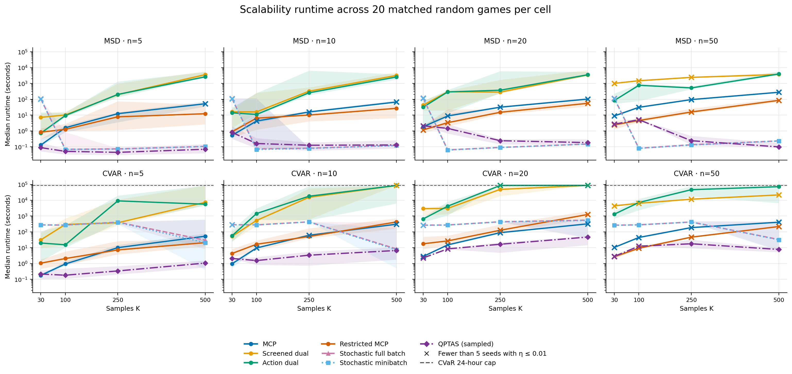
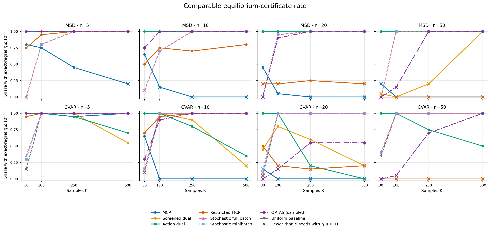

# Coherent Utility Measure Games (`cumg`)

Reference implementation and reproducibility artifacts for
[*Data-Driven Games with Coherent Risk Measures*](https://arxiv.org/abs/2605.19302)
by Bharat Gangwani and Arunesh Sinha.

Coherent Utility Measure Games (CUMGs) model players whose uncertain payoffs
are evaluated with coherent utility (risk) measures. The paper studies their
connection to distributionally robust games, equilibrium existence and
complexity, multilinear complementarity formulations, sparse-support search,
and stochastic first-order computation. This repository implements the main
MSD and lower-tail CVaR formulations and preserves the experiment outputs used
to compare the computational approaches.

## What the package supports

- Mean-semideviation (MSD) and lower-tail CVaR two-player bimatrix games.
- Pyomo MCP model builders and solver wrappers for PATH/PATHAMPL, with an
  optional IPOPT fallback.
- Randomized small-support search using screening, action-dual, and restricted
  MCP subproblems.
- Full-batch and minibatch stochastic first-order solvers for smoothed CUMGs.
- Exact-regret certificates and reproducible random-game generators.

## Scalability experiments

The committed scalability experiments compare six methods on random two-player
games with `n ∈ {5, 10, 20, 50}` actions per player and
`K ∈ {5, 10, 30, 100, 250, 500}` payoff samples. Each method uses the same 20
game seeds within a `(risk, K, n)` cell. Payoffs are sampled independently from
`Uniform[0, 1]`, with `gamma=0.5`, `alpha=0.5` for CVaR, and target
`epsilon=0.01`. The figures omit `K=5` and `K=10` for legibility.

The final CVaR campaign imposes a 24-hour wall-clock cap separately on every
method and replicate. Timeout runtimes are therefore right-censored at 86,400
seconds. MSD uses the original uncapped campaign. Runtime is the duration of
the configured attempt, whether or not it produced a certificate.

### Runtime scaling



*Points are medians over 20 matched games and bands are interquartile ranges.
Crosses mark cells in which none of the 20 attempts met that method's configured
success criterion. CVaR timeout attempts contribute their 24-hour cap, so these
are observed-or-capped runtime summaries rather than uncensored completion
times.*

### Comparable equilibrium certificates



*A run is counted when its recorded exact-regret certificate satisfies
\(η ≤ 10^-2\). This common ex-post criterion is used instead of the
methods' native success flags; in particular, the stochastic runs used a
stricter stopping tolerance. The uniform profile is included as a diagnostic
baseline on the same game seeds.*

### Main takeaways

- **CVaR equilibrium solves take longer.** Within the displayed grid, 126 of
  1,920 configured CVaR method runs reached the 24-hour cap: 75 action-dual and
  51 screened-dual runs. No other method recorded a timeout.
- **Fast completion is not the same as successful certification.** Direct MCP
  and restricted MCP often terminate much sooner than the sparse-support
  methods, but their common-certificate rates fall sharply as the action space
  grows. At `K=500, n=50`, neither method certifies any of the 20 games under
  either risk model.
- **Sparse-support robustness is costly.** Action dual certifies all 320
  displayed MSD instances, but its median runtime across those instances is
  about 300 seconds. Under CVaR its certificate rate is 245/320 and it accounts
  for most capped runs.
- **The stochastic variants track each other closely here.** Full-batch and
  minibatch each certify 260/320 CVaR and 231/320 MSD instances under the common
  threshold. In the largest displayed cell, both certify 20/20 instances, with
  median runtimes of roughly 31--33 seconds for CVaR and 0.23 seconds for MSD.
  This primarily reflects the initialized uniform action profile already being
  an epsilon-equilibrium at the chosen tolerance because payoffs concentrate in
  these random games.
- **The random-game design has a strong concentration effect.** The uniform
  profile is already certified on 253/320 CVaR and 231/320 MSD instances and on
  every `K=500` instance. This is expected with high probability given the proof
  of Theorem 4 in the paper.

These comparisons are descriptive of the committed random-instance design and
fixed algorithm configurations. They do not establish asymptotic dominance,
and capped CVaR runtimes should not be interpreted as completed solve times.

Regenerate the two figures from the curated results with:

```bash
python experiments/generate_readme_figures.py
```

The source notebook is [`experiments/mcpAlgoAnalysis.ipynb`](experiments/mcpAlgoAnalysis.ipynb).
See [`experiments/results/README.md`](experiments/results/README.md) for dataset
provenance and [`experiments/REMOTE_SCALABILITY.md`](experiments/REMOTE_SCALABILITY.md)
for the remote-run and capped-resume protocol.

## Installation

From this repository:

```bash
pip install -e ".[dev,notebooks]"
```

For optional Mystic seeding:

```bash
pip install -e ".[mystic]"
```

## External solvers

The package does not vendor PATH, PATHAMPL, IPOPT, or other solver binaries.
Install and license those tools separately, then make the solver executable
visible to Pyomo.

- [Pyomo installation guide](https://pyomo.readthedocs.io/en/stable/installation.html)
- [PATH solver download and license notes](https://pages.cs.wisc.edu/~ferris/path.html)
- [AMPL Community Edition](https://ampl.com/ce/)
- [COIN-OR Ipopt installation guide](https://coin-or.github.io/Ipopt/INSTALL.html)

For a conda-based IPOPT setup:

```bash
conda install -c conda-forge ipopt
```

Check which solver executables are visible:

```python
from cumg import available_solvers, format_solver_availability

print(available_solvers())
print(format_solver_availability())
```

Model construction and payoff/regret utilities work without solver binaries;
MCP solves require an available backend.

## Quickstart

```python
import numpy as np

from cumg import build_msd_mcp_model, solve_msd_mcp

A = [
    np.array([[0.8, 0.1], [0.2, 0.6]]),
    np.array([[0.3, 0.9], [0.7, 0.4]]),
]
B = [
    np.array([[0.4, 0.7], [0.9, 0.2]]),
    np.array([[0.6, 0.3], [0.1, 0.8]]),
]
p = np.array([0.5, 0.5])

model = build_msd_mcp_model(A, B, p, gamma=0.8)
result = solve_msd_mcp(A, B, p, gamma=0.8, solver="pathampl")

print(result.x, result.y)
```

## Repository layout

- `src/cumg/`: installable package source.
- `tests/`: solver-free and solver-gated tests.
- `examples/`: small runnable examples.
- `experiments/`: experiment runners, analysis notebooks, and documentation.
- `experiments/results/`: committed CSV outputs; these are not installed as
  package data.
- `docs/figures/`: static figures generated from the curated results.
- `notebooks/`: exploratory notebooks retained for reference.

## Development checks

```bash
python -m compileall src tests examples experiments/generate_readme_figures.py
pytest
ruff check src tests examples experiments/generate_readme_figures.py
ruff format --check src tests examples experiments/generate_readme_figures.py
```

Solver-gated tests are marked with `pytest.mark.solver` and skip when
PATH/PATHAMPL or IPOPT is unavailable.

## Citation

If you use the code or experiment artifacts, please cite:

> Bharat Gangwani and Arunesh Sinha. “Data-Driven Games with Coherent Risk
> Measures.” arXiv:2605.19302 [cs.GT], 2026.

```bibtex
@misc{gangwani2026datadriven,
  title         = {Data-Driven Games with Coherent Risk Measures},
  author        = {Gangwani, Bharat and Sinha, Arunesh},
  year          = {2026},
  eprint        = {2605.19302},
  archivePrefix = {arXiv},
  primaryClass  = {cs.GT},
  url           = {https://arxiv.org/abs/2605.19302}
}
```

## License

The Python package code is released under the MIT License. Third-party solver
binaries and reference PDFs are not included; obtain them from their original
sources and follow their licenses.
